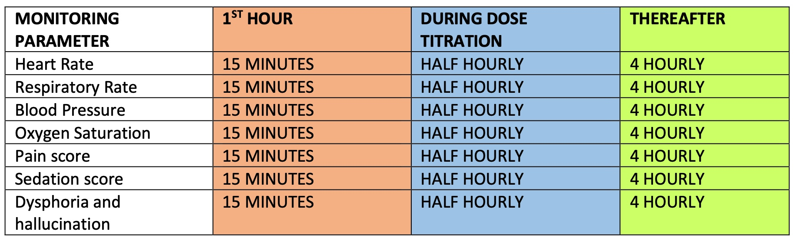

# Monitoring

For patient’s receiving oral ketamine, there isn’t a requirement for additional monitoring of vital signs. However, all patient’s receiving low dose IV ketamine infusions will require monitoring as per the table below, which will be documented onto the prescription chart (see appendix 1)

(\#fig:nice-fig)Suggested frequency that a patient's observations should be recorded when starting or changing ketamine.

